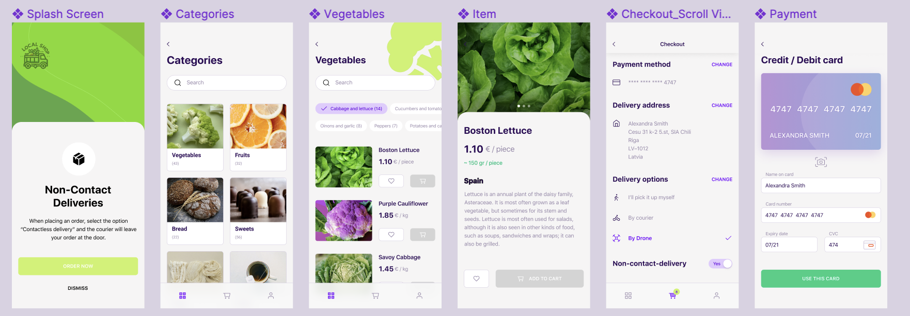

### A non functional app made to play around with Electron and React-ts. The app was built using [**E**lectron **R**eact **B**oilerplate](https://github.com/electron-react-boilerplate/electron-react-boilerplate) and following this spreadsheet:

 